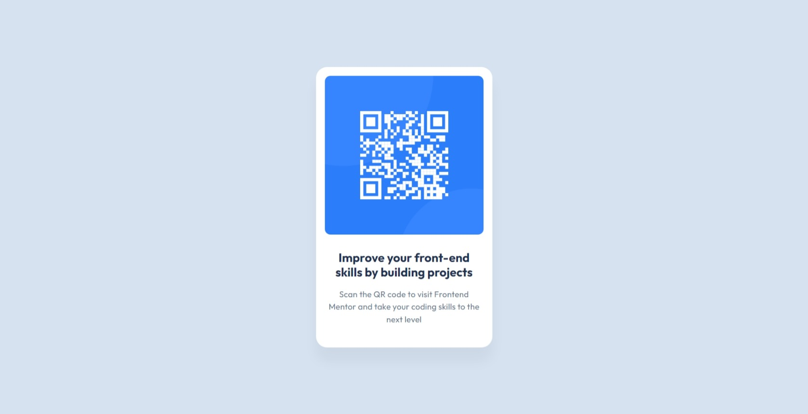

# Frontend Mentor - QR code component solution

This is a solution to the [QR code component challenge on Frontend Mentor](https://www.frontendmentor.io/challenges/qr-code-component-iux_sIO_H). Frontend Mentor challenges help you improve your coding skills by building realistic projects. 

- Solution URL: [https://www.frontendmentor.io/solutions/qr-code-component-using-css-flewbox-to-center-the-component-9XnzfspUXe](https://www.frontendmentor.io/solutions/qr-code-component-using-css-flewbox-to-center-the-component-9XnzfspUXe)
- Live Site URL: [https://artemgolovko.github.io/qr-code-component](https://artemgolovko.github.io/qr-code-component)

## Screenshot

## Author

- Website - [artemgolovko.github.io](https://artemgolovko.github.io)
- Frontend Mentor - [@ArtemGolovko](https://www.frontendmentor.io/profile/ArtemGolovko)

